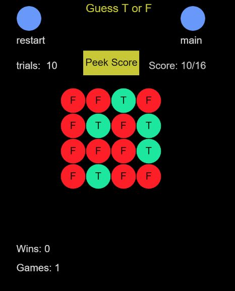

# Guess Pattern (MineClear)

Suppose you are in an exam and you have to answer a set of True or False questions. Also, suppose you do not know the correct answers to any of the questions. In this situation, all you can do is random guessing and normally your chance score will be around 50%. Let’s say the teacher who marks your work gives you many more trials to answer the same set of the questions and you can peek at your total score at the end of each trial. What is the optimal way to maximize the information gain from your past trials to reach the perfect score with a minimal number of trials?

For more inforation about this game and the optimal strategy to win please read this blog: 

https://www.brainxyz.com/blog/mineclear/

To play the game on your browser:

https://hunar4321.github.io/Guess_Pattern/

The game is also avaible on Google play under the name MineClear:

https://play.google.com/store/apps/details?id=com.brainxyz.mineclear

 
