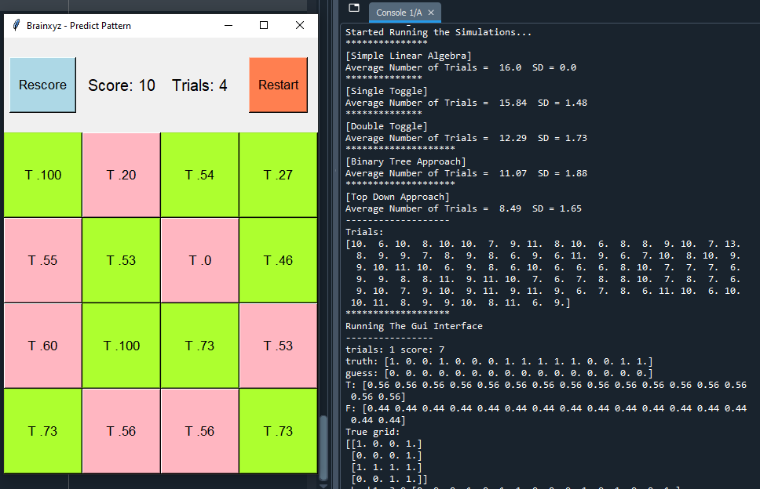

# Predict Pattern & Top Down Approach

Suppose in an exam you have to answer a set of True or False questions and you do not know the correct answer to any of the questions. In this situation, all you can do is random guessing, hence, your score will be around 50% by chance. Let’s say the teacher who marks your work gives you many more trials to answer the same set of the questions and you can peek at your total score at the end of each trial. What is the optimal way to reach the perfect score with a minimal number of trials?

**You can play a game based on the above puzzle in your browser:**
https://hunar4321.github.io/predict-pattern/

**Video Explanation:**
https://youtu.be/5qqxGwlUilU

**Blog:** 
https://www.brainxyz.com/blog/predict/

**The following python script, tests various alogrithms to solve the above question.**

https://github.com/hunar4321/predict-pattern/blob/master/predict_pattern_algorithms.py

 
